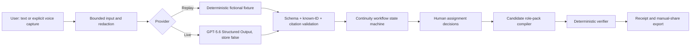

# System Architecture

## Trust boundaries

1. Browser input is untrusted and never authoritative by itself.
2. The provider may propose structured analysis but cannot authorize or verify.
3. Application validation establishes grounding against the bounded fact set.
4. The user owns approval decisions.
5. The deterministic compiler/verifier owns candidate and verified states.
6. Export is local; P0 has no outbound connector.

## Runtime

One Next.js TypeScript app supports static Replay deployment and server-backed local Live mode. Public static hosting must disable Live with an honest explanation. A server deployment may enable Live only with a server-side API key.

## State machine

`idle → mapped → rehearsed → review_pending → candidate_compiled → verified → exported`

Any provider, validation, or approval failure transitions to a typed error without mutating prior verified state.

